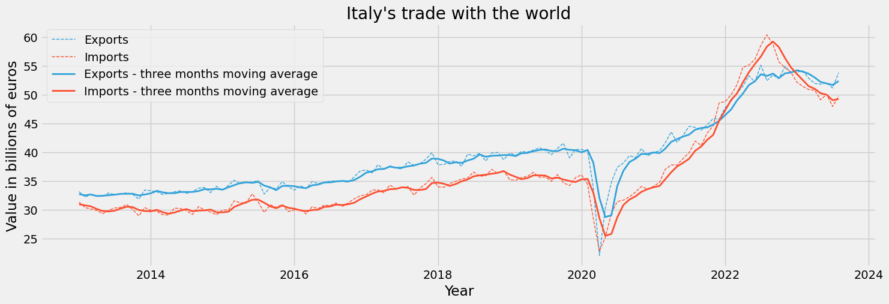

<!-- WARNING: THIS FILE WAS AUTOGENERATED! DO NOT EDIT! -->


`istatapi` is a Python interface to discover and retrieve data from
ISTAT API (The Italian National Institute of Statistics). The library is
designed to explore ISTAT metadata and to retreive data in different
formats. `istatapi` is built on top of [ISTAT SDMX RESTful
API](https://developers.italia.it/it/api/istat-sdmx-rest).

Whether you are an existing organization, a curious individual or an
academic researcher, `istatapi` aims to allow you to easily access ISTAT
databases with just a few lines of code. The library implements
functions to:

- Explore all available ISTAT datasets (dataflows in SDMX terminology)
- Search available datasets by keywords
- Retrieve information on a specific dataset like: the ID of the
  dataflow, the names and available values of the dimensions of the
  dataset, available filters.
- Get data of an available dataset in a pandas DataFrame, csv or json
  format.

## Install

You can easily install the library by using the pip command:

`pip install istatapi`

## Tutorial

First, let’s simply import the modules we need:

``` python
from istatapi import discovery, retrieval
import matplotlib.pyplot as plt
```

With `istatapi` we can search through all the available datasets by
simply using the following function:

``` python
discovery.all_available()
```

<table border="1" class="dataframe">
  <thead>
    <tr style="text-align: right;">
      <th></th>
      <th>df_id</th>
      <th>version</th>
      <th>df_description</th>
      <th>df_structure_id</th>
    </tr>
  </thead>
  <tbody>
    <tr>
      <th>0</th>
      <td>101_1015</td>
      <td>1.3</td>
      <td>Crops</td>
      <td>DCSP_COLTIVAZIONI</td>
    </tr>
    <tr>
      <th>1</th>
      <td>101_1030</td>
      <td>1.0</td>
      <td>PDO, PGI and TSG quality products</td>
      <td>DCSP_DOPIGP</td>
    </tr>
    <tr>
      <th>2</th>
      <td>101_1033</td>
      <td>1.0</td>
      <td>slaughtering</td>
      <td>DCSP_MACELLAZIONI</td>
    </tr>
    <tr>
      <th>3</th>
      <td>101_1039</td>
      <td>1.2</td>
      <td>Agritourism - municipalities</td>
      <td>DCSP_AGRITURISMO_COM</td>
    </tr>
    <tr>
      <th>4</th>
      <td>101_1077</td>
      <td>1.0</td>
      <td>PDO, PGI and TSG products:  operators - municipalities data</td>
      <td>DCSP_DOPIGP_COM</td>
    </tr>
  </tbody>
</table>

You can also search for a specific dataset (in this example, a dataset
on imports), by doing:

``` python
discovery.search_dataset("import")
```

<table border="1" class="dataframe">
  <thead>
    <tr style="text-align: right;">
      <th></th>
      <th>df_id</th>
      <th>version</th>
      <th>df_description</th>
      <th>df_structure_id</th>
    </tr>
  </thead>
  <tbody>
    <tr>
      <th>10</th>
      <td>101_962</td>
      <td>1.0</td>
      <td>Livestock import export</td>
      <td>DCSP_LIVESTIMPEXP</td>
    </tr>
    <tr>
      <th>47</th>
      <td>139_176</td>
      <td>1.0</td>
      <td>Import and export by country and commodity Nace 2007</td>
      <td>DCSP_COEIMPEX1</td>
    </tr>
    <tr>
      <th>49</th>
      <td>143_222</td>
      <td>1.0</td>
      <td>Import price index - monthly data</td>
      <td>DCSC_PREIMPIND</td>
    </tr>
  </tbody>
</table>

To retrieve data from a specific dataset, we first need to create an
instance of the
[`DataSet`](https://Attol8.github.io/istatapi/discovery.html#dataset)
class. We can use `df_id`, `df_description` or `df_structure_id` from
the above DataFrame to tell to the
[`DataSet`](https://Attol8.github.io/istatapi/discovery.html#dataset)
class what dataset we want to retrieve. Here, we are going to use the
`df_id` value. This may take a few seconds to load.

``` python
# initialize the dataset and get its dimensions
ds = discovery.DataSet(dataflow_identifier="139_176")
```

We now want to see what variables are included in the dataset that we
are analysing. With `istatapi` we can easily print its variables
(“dimensions” in ISTAT terminology) and their description.

``` python
ds.dimensions_info()
```

<table border="1" class="dataframe">
  <thead>
    <tr style="text-align: right;">
      <th></th>
      <th>dimension</th>
      <th>dimension_ID</th>
      <th>description</th>
    </tr>
  </thead>
  <tbody>
    <tr>
      <th>0</th>
      <td>FREQ</td>
      <td>CL_FREQ</td>
      <td>Frequency</td>
    </tr>
    <tr>
      <th>1</th>
      <td>MERCE_ATECO_2007</td>
      <td>CL_ATECO_2007_MERCE</td>
      <td>Commodity Nace 2007</td>
    </tr>
    <tr>
      <th>2</th>
      <td>PAESE_PARTNER</td>
      <td>CL_ISO</td>
      <td>Geopolitics</td>
    </tr>
    <tr>
      <th>3</th>
      <td>ITTER107</td>
      <td>CL_ITTER107</td>
      <td>Territory</td>
    </tr>
    <tr>
      <th>4</th>
      <td>TIPO_DATO</td>
      <td>CL_TIPO_DATO12</td>
      <td>Data type 12</td>
    </tr>
  </tbody>
</table>

Now, each dimension can have a few possible values. `istatapi` provides
a quick method to analyze these values and print their English
descriptions.

``` python
dimension = "TIPO_DATO" #use "dimension" column from above
ds.get_dimension_values(dimension)
```

<table border="1" class="dataframe">
  <thead>
    <tr style="text-align: right;">
      <th></th>
      <th>values_ids</th>
      <th>values_description</th>
    </tr>
  </thead>
  <tbody>
    <tr>
      <th>0</th>
      <td>EV</td>
      <td>export - value (euro)</td>
    </tr>
    <tr>
      <th>1</th>
      <td>TBV</td>
      <td>trade balance - value (euro)</td>
    </tr>
    <tr>
      <th>2</th>
      <td>ISAV</td>
      <td>import - seasonally adjusted value - world based model (millions of euro)</td>
    </tr>
    <tr>
      <th>3</th>
      <td>ESAV</td>
      <td>export - seasonally adjusted value - world based model (millions of euro)</td>
    </tr>
    <tr>
      <th>4</th>
      <td>TBSAV</td>
      <td>trade balance - seasonally adjusted value  -world based model (millions of euro)</td>
    </tr>
    <tr>
      <th>5</th>
      <td>IV</td>
      <td>import - value (euro)</td>
    </tr>
  </tbody>
</table>

If we do not filter any of our variables, the data will just include all
the possible values in the dataset. This could result in too much data
that would slow our code and make it difficult to analyze. Thus, we need
to filter our dataset. To do so, we can simply use the `values_ids` that
we found using the function `get_dimension_values` in the cell above.

**Note**: Make sure to pass the names of the dimensions in lower case
letters as arguments of the `set_filter` function. If you want to filter
for multiple values, simply pass them as lists.

``` python
freq = "M" #monthly frequency
tipo_dato = ["ISAV", "ESAV"] #imports and exports seasonally adjusted data
paese_partner = "WORLD" #trade with all countries

ds.set_filters(freq = freq, tipo_dato = tipo_dato, paese_partner = paese_partner)
```

Having set our filters, we can now finally retrieve the data by simply
passing our
[`DataSet`](https://Attol8.github.io/istatapi/discovery.html#dataset)
instance to the function
[`get_data`](https://Attol8.github.io/istatapi/retrieval.html#get_data).
It will return a pandas DataFrame with all the data that we requested.
The data will be already sorted by datetime

``` python
trade_df = retrieval.get_data(ds)
trade_df.head()
```

<table border="1" class="dataframe">
  <thead>
    <tr style="text-align: right;">
      <th></th>
      <th>DATAFLOW</th>
      <th>FREQ</th>
      <th>MERCE_ATECO_2007</th>
      <th>PAESE_PARTNER</th>
      <th>ITTER107</th>
      <th>TIPO_DATO</th>
      <th>TIME_PERIOD</th>
      <th>OBS_VALUE</th>
      <th>BREAK</th>
      <th>CONF_STATUS</th>
      <th>OBS_PRE_BREAK</th>
      <th>OBS_STATUS</th>
      <th>BASE_PER</th>
      <th>UNIT_MEAS</th>
      <th>UNIT_MULT</th>
      <th>METADATA_EN</th>
      <th>METADATA_IT</th>
    </tr>
  </thead>
  <tbody>
    <tr>
      <th>0</th>
      <td>IT1:139_176(1.0)</td>
      <td>M</td>
      <td>10</td>
      <td>WORLD</td>
      <td>ITTOT</td>
      <td>ESAV</td>
      <td>1993-01-01</td>
      <td>10775</td>
      <td>NaN</td>
      <td>NaN</td>
      <td>NaN</td>
      <td>NaN</td>
      <td>NaN</td>
      <td>NaN</td>
      <td>NaN</td>
      <td>NaN</td>
      <td>NaN</td>
    </tr>
    <tr>
      <th>360</th>
      <td>IT1:139_176(1.0)</td>
      <td>M</td>
      <td>10</td>
      <td>WORLD</td>
      <td>ITTOT</td>
      <td>ISAV</td>
      <td>1993-01-01</td>
      <td>9229</td>
      <td>NaN</td>
      <td>NaN</td>
      <td>NaN</td>
      <td>NaN</td>
      <td>NaN</td>
      <td>NaN</td>
      <td>NaN</td>
      <td>NaN</td>
      <td>NaN</td>
    </tr>
    <tr>
      <th>364</th>
      <td>IT1:139_176(1.0)</td>
      <td>M</td>
      <td>10</td>
      <td>WORLD</td>
      <td>ITTOT</td>
      <td>ISAV</td>
      <td>1993-02-01</td>
      <td>10014</td>
      <td>NaN</td>
      <td>NaN</td>
      <td>NaN</td>
      <td>NaN</td>
      <td>NaN</td>
      <td>NaN</td>
      <td>NaN</td>
      <td>NaN</td>
      <td>NaN</td>
    </tr>
    <tr>
      <th>4</th>
      <td>IT1:139_176(1.0)</td>
      <td>M</td>
      <td>10</td>
      <td>WORLD</td>
      <td>ITTOT</td>
      <td>ESAV</td>
      <td>1993-02-01</td>
      <td>10692</td>
      <td>NaN</td>
      <td>NaN</td>
      <td>NaN</td>
      <td>NaN</td>
      <td>NaN</td>
      <td>NaN</td>
      <td>NaN</td>
      <td>NaN</td>
      <td>NaN</td>
    </tr>
    <tr>
      <th>365</th>
      <td>IT1:139_176(1.0)</td>
      <td>M</td>
      <td>10</td>
      <td>WORLD</td>
      <td>ITTOT</td>
      <td>ISAV</td>
      <td>1993-03-01</td>
      <td>9951</td>
      <td>NaN</td>
      <td>NaN</td>
      <td>NaN</td>
      <td>NaN</td>
      <td>NaN</td>
      <td>NaN</td>
      <td>NaN</td>
      <td>NaN</td>
      <td>NaN</td>
    </tr>
  </tbody>
</table>

Now that we have our data, we can do whatever we want with it. For
example, we can plot the data after having it cleaned up a bit. You are
free to make your own analysis!

``` python
# set matplotlib themes
plt.style.use('fivethirtyeight')
plt.rcParams['figure.figsize'] = [16, 5]

#fiveThirtyEight palette
colors = ['#30a2da', '#fc4f30', '#e5ae38', '#6d904f', '#8b8b8b']

# calculate moving averages for the plot
trade_df["MA_3"] = trade_df.groupby("TIPO_DATO")["OBS_VALUE"].transform(
    lambda x: x.rolling(window=3).mean()
)

#replace the "TIPO_DATO" column values with more meaningful labels
trade_df["TIPO_DATO"] = trade_df["TIPO_DATO"].replace(
    {"ISAV": "Imports", "ESAV": "Exports"}
)

# Plot the data
after_2013 = trade_df["TIME_PERIOD"] >= "2013"
is_ESAV = trade_df["TIPO_DATO"] == "Exports"
is_ISAV = trade_df["TIPO_DATO"] == "Imports"

exports = trade_df[is_ESAV & after_2013].rename(columns={"OBS_VALUE": "Exports", "MA_3": "Exports - three months moving average"})
imports = trade_df[is_ISAV & after_2013].rename(columns={"OBS_VALUE": "Imports", "MA_3": "Imports - three months moving average"})

plt.plot(
    "TIME_PERIOD",
    "Exports",
    data=exports,
    marker="",
    linestyle="dashed",
    color = colors[0],
    linewidth=1
)
plt.plot(
    "TIME_PERIOD",
    "Imports",
    data=imports,
    marker="",
    linestyle="dashed",
    color = colors[1],
    linewidth=1
)
plt.plot(
    "TIME_PERIOD",
    "Exports - three months moving average",
    data=exports,
    color = colors[0],
    linewidth=2
)
plt.plot(
    "TIME_PERIOD",
    "Imports - three months moving average",
    data=imports,
    marker="",
    color = colors[1],
    linewidth=2
)

# add a title
plt.title("Italy's trade with the world")

# add a label to the x axis
plt.xlabel("Year")

# turn y scale from millions to billions (divide by a 1000), and add a label
plt.ylabel("Value in billions of euros")
plt.gca().yaxis.set_major_formatter(plt.FuncFormatter(lambda x, loc: "{:,}".format(int(x/1000))))
```



With just a few lines of code, we have been able to retrieve data from
ISTAT and make a simple plot. This is just a simple example of what you
can do with `istatapi`. You can find more examples in the `_examples`
folder. Enjoy!
